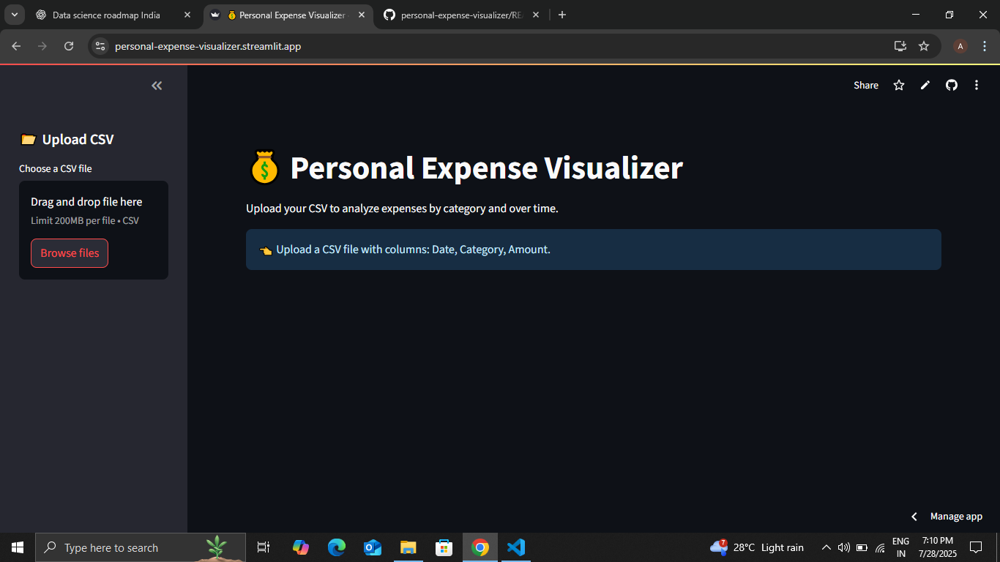
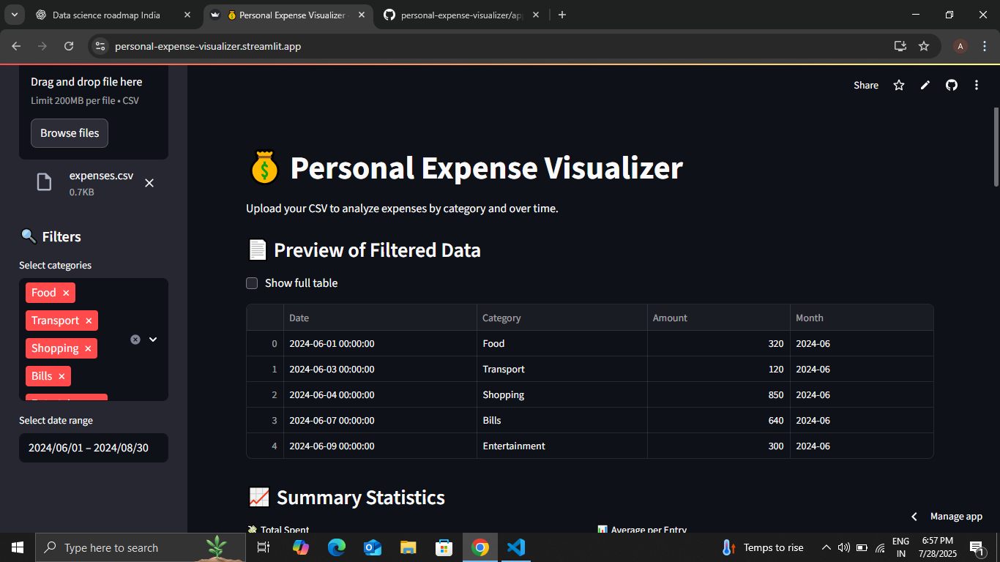
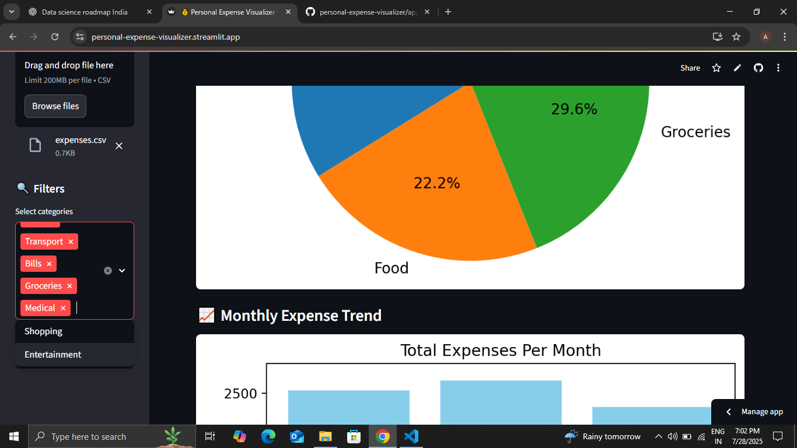
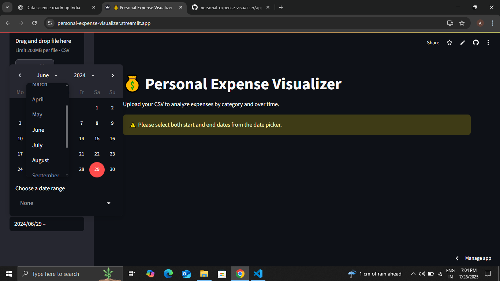

# 💰 Personal Expense Visualizer

A beginner-friendly Streamlit web app to analyze personal spending using charts and filters — perfect for students or professionals managing monthly budgets.

---

## 🚀 Features

- 📂 Upload a CSV with `Date`, `Category`, and `Amount` columns
- 🔍 Filter by date range and expense categories
- 📊 View category-wise spending as a pie chart
- 📈 See monthly trends in bar chart format
- 📄 Preview first 5 rows or full table
- 📈 View total and average spending
- ⬇️ Download filtered data as CSV
- 🇮🇳 Fully localized for INR (₹)

---

# 📁 Sample CSV Format

```csv
Date,Category,Amount
2024-06-01,Food,320
2024-06-04,Shopping,850
2024-06-07,Bills,640
2024-07-02,Groceries,600
2024-07-10,Shopping,990
```


---

## 🛠 Tech Stack

- Python - programming language
- Streamlit – web framework
- Pandas – for data analysis
- Matplotlib – for charts

---

## 💻 How to Run Locally

# 1. Clone the repository
git clone https://github.com/prashant-singh77/personal-expense-visualizer.git

# 2. Change directory
cd personal-expense-visualizer

# 3. Install dependencies
pip install -r requirements.txt

# 4. Run the app
streamlit run app.py

---

## 📸 Screenshots

### 🖥️ Home Screen



---

### 🧮 CSV Upload + Filters Applied



---

### 📊 Category & Monthly Expense Charts



---

### ⚠️ Error Handling for Wrong Date Range



---

personal-expense-visualizer/
├── app.py # Main Streamlit app
├── requirements.txt # Python dependencies
├── README.md # Project documentation
├── expenses.csv # Sample CSV to test
├── screenshot-home.png # Home screen screenshot
├── screenshot-filter.png # Filter view screenshot
├── screenshot-chart.png # Charts screenshot
└── error-date-range.png # Error handling screenshot


---

🧠 What I Learned
✅ How to build interactive Streamlit dashboards

✅ Real-time filtering and grouping with Pandas

✅ Clean UX design with Streamlit layout

✅ Deploying data apps online using free tools

---

👤 Author :
Made with ❤️ by Prashant singh
GitHub: https://github.com/prashant-singh77


